# CSN DevSecOps Capstone Project 
A demo application "brokencrystals" is used for this capstone project. BrokenCrystals is a benchmark application that simulates a vulnerable environment. The repo ```https://github.com/NeuraLegion/brokencrystals``` was cloned and necessary modifications made to execute and meet the project requirements and deliverables. 

Details on the description of the benchmark Broken Crystals application alongside how to build & run the application and the vulnerabilities overview can be accessed [here](#https://github.com/NeuraLegion/brokencrystals)

## Objective
To implement a secure CI/CD pipeline using either Jenkins or GitHub Actions to automate the build, test, and deployment processes, incorporating security best practices throughout the development lifecycle.

## Key Requirements
**1.** Static Code Analysis: Integrate a Static Application Security Testing (SAST) tool (such as SonarQube or Snyk) into the pipeline to analyze code for vulnerabilities. For more information, click [here](#static-code-analysis-sast---creating-a-jenkins-pipeline-for-sonarqube-scanning)

**2.** AWS EKS Cluster provisioning and Secrets Management: Utilize a secrets management tool (like HashiCorp Vault or AWS Secrets Manager) to securely manage sensitive information and credentials. Detailed instructions can be found [here](#deployment-to-aws-eks-integrated-with-aws-secrets-manager)

**3.** Docker Image: Build and push the Docker image to any selected Docker registry (such as Amazon ECR or Docker Hub) following security best practices. Configure image scanning for the deployed Docker images to detect vulnerabilities. Skip to this section by clicking [here](#image-scanning-for-deployed-docker-images-on-dockerhub)

**4.** Deployment: Deploy the application to a Kubernetes cluster provisioned with Minikube or Kind. Use port forwarding to ensure that the application is publicly accessible. For more information, click [here](#application-deployment-steps-using-github-actions)

**5.** Dynamic Application Security Testing (DAST): Implement DAST tools (such as OWASP ZAP) into the pipeline to test for vulnerabilities after deployment. For more information, click [here](#running-the-owasp-zap-dast-scan-via-github-actions-workflow)

## Static Code Analysis (SAST) - Creating a Jenkins Pipeline for SonarQube Scanning

**1.** Provision an amazon linux t2.large ec2 instance and assign ssm role. Ensure your instance security group has the necessary inbound rules to allow for access via ports 9090, 9000 etc.

**2.** Connect to your instance via session manager on the console. 

**3**. Move to root user, make sure you are in the usr directory, hence run ```cd ..``` if you are in bin. directory
```
sudo su
```

**4.** Run the following command to download install.sh file to install docker on your instance.
```
wget -O install.sh https://raw.GitHubusercontent.com/kattafuah/brokencrystals/refs/heads/stable/jenkins_SonarQube/install.sh
```

**5.** Add executable permission for install.sh file.
```
chmod +x install.sh
```

**6.** Run install.sh to install docker.
```
./install.sh
 ``` 
   or 
```
bash install.sh
```

**7.** Download docker-compose.yml files for jenkins and sonarqube containers.
```
wget -O docker-compose.yml https://raw.GitHubusercontent.com/kattafuah/brokencrystals/refs/heads/stable/jenkins_SonarQube/docker-compose.yml
```

**8.** Run Jenkins and SonarQube containers.
```
docker-compose up -d
```

**9.** Run the following command to get the jenkins default administrator password in the jenkins container.
```
docker exec -it demo-jenkins cat /var/jenkins_home/secrets/initialAdminPassword
```

**10.** Access the Jenkins Server and install pluggins.

Access jenkins on the browser with ```http://<your instance ipaddress>:9090``` **eg..** ```http://35.172.200.81:9090```

_Install suggested initial plugins and create your first Admin User by setting your new user name, password etc.:_

* Go to "Manage jenkins", 
* Got to "Plugins", 
* Click on "Available Plugins" 
* Type "SonarQube scanner" in the search bar, check it, 
* Click "Install" on the top right corner
* Scroll down and check the restart option.

If Jenkins becomes inaccessible, go to the terminal and start the Jenkins container
```docker start <container-id>``` 

_Run ```docker ps -a``` to list the containers on your instance._ 

**eg.** 
```
docker start 5dc03904e0cc 
```

**11.** Access the SonarQube Server.

* Access SonarQube on the browser with ```http://ipaddress:9000``` **eg.** ```http://35.172.200.81:9000```
* Initial username and password for SonarQube are ```admin``` and ```admin``` respectively.
* Set your new password and click "Update".
* Click on "create a local project".
* Enter Project display name and Project Key, take note of these two as they will be very essential for the pipeline, in this project, "cloudsec-capstone" was used for both.
* Enter Main branch name, make sure this is the name of your main branch in the repository you will be using. In this case it is "stable".
* Click Next.
* Check "Use the global setting".
* Scroll down and click "Create new project".
* Click "Project" at the top menu and notice your project display name showing, in this case it is cloudsec-capstone.

**12.** Generate a token on the SonarQube Server to be used for Jenkins pipeline.

* Click on "A" at the top right corner.
* Select Administrator
* Click on "Security".

* Under 'Generate Tokens', enter a name for your token **eg.** ```cloudsec-capstone-token```
* Choose "Project Analysis token" under "Type" 
* The project name **eg.** "cloudsec-capstone" will populate under "Project".
* You can set the expiry period under "Expires in" to your preferred duration. For this project the default 30 days expiry period is used.
* Click "Generate".
* Copy and save the token securely.

**13.** Configure SonarQube Scanner in Jenkins.
 
 Go back to the Jenkins server
* Go to "Manage Jenkins".
* Under "System Configuration" click on "System" to configure global settings and paths.
* Scroll down to SonarQube Servers, check "Environmental variables" and click on "Add SonarQube" button under SonarQube installations. Enter a name of your choice under "Name" **eg.** "SonarQube" (take note of the name you use). Copy and paste the SonarQuber server URL under "Server URL" **eg.** ```http://35.172.200.81:9000```.
* For "Server authentication token" click the "+ Add" tab and select "Jenkins"
* In the pop up window, select "secret text" under "Kind", copy and paste the generated SonarQube token under "Secret". Give an appropriate description and ID (one is generated if left blank) of your choosing then click "Add".
* Now that the credential has been created, click on the drop down under "Server authentication token" and select the description you entered in the above step.
* Scroll down and click "Save".

* Click on "Manage Jenkins".
* Under "System Configuration", click on Tools.
* Scroll down to SonarQube Scaner installations. Click on "Add SonarQube Scanner" and enter the name as entered under "System" for "SonarQube Installations", that is "SonarQube".
* Click on "Save".

Now a connection has been created between the Jenkins Server and the SonarQube Server.

**14.** Create a Jenkins pipeline job.

* Click on "Dashboard". 
* Under "Start building your software project", click "Create a job".
* Name your job, for **eg.** "Cloudsec-Capstone-Project".
* Click on "Pipeline".
* Click "OK".
* Scroll down to the "Pipeline" section of Build Triggers in the configuration page that comes up and select "Pipeline script from SCM". Select "Git" under "SCM" then copy and paste your GitHub repositories URL **eg.** ```https://github.com/Kattafuah/brokencrystals``` under "Repository URL".
* You don't need a credential if your repository is a public, like this repository.
* Change the name under "Branch specifier" from "*/master" to "*/stable" as is the name of the branch we are using in this repository.
* Scroll down and ensure the "Script path" is "Jenkinsfile".
* The Jenkinsfile must be in the repository. The content of the file in this repository is:

```
node {
  stage('SCM') {
    checkout scm
  }
  stage('SonarQube Analysis') {
    def scannerHome = tool 'SonarQube';
    withSonarQubeEnv() {
      sh "${scannerHome}/bin/sonar-scanner"
    }
  }
}
```
**_You must always ensure that the name of the tool you gave under SonarQube Scanner on jenkins/tools is  same as in the pipeline script for SonarQube (**eg..**"def scannerHome = tool 'SonarQube';" the name in this case is SonarQube')_**

Also check the content of "sonar-project.properties" file:

```
sonar.projectKey=cloudsec
```
The key "cloudsec" should be same as provided in the SonarQube project creation. 

* Click "Save"

Now a connection has been created between the GitHub repository and the Jenkins Server 


* Click on "Build Now" to trigger the pipeline


You can check the progress of the build by clicking on the drop down shown below and selecting "Console Output".

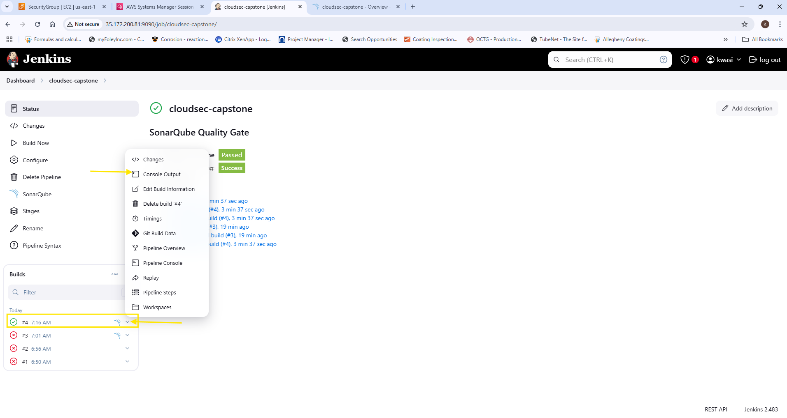

A successful build shows a green tick in a circle.

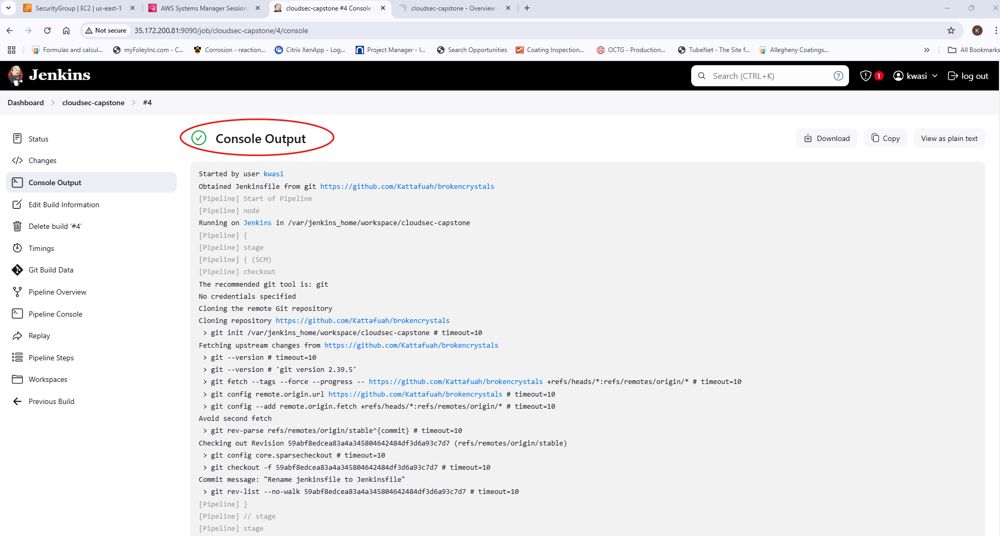


Go to the SonarQube Server, Click on "Projects" and view the result of assessment as in the picture below:

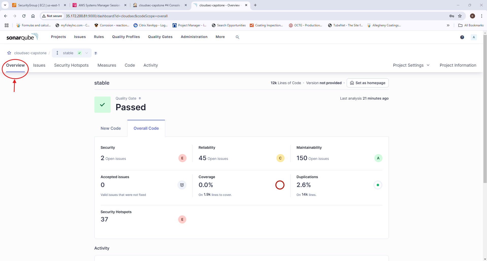

Clearly there results show security, reliability, maintainability, duplications and security hostpots issue that need to be addressed.

### GitHub Webhook

You can automate the the build trigger by using a GitHub webhook:

* Go to your GitHub repository
* Click on "Settings" 
* Under "Code and automations", click on "Webhooks"
* Click on "Add webhook" and enter your GitHub password
* Enter a URL on this fashion ```http://jenkins_ipaddress:9090/github-webhook/``` as the Payload URL **eg.** ```http://54.146.201.60:9090/github-webhook/```

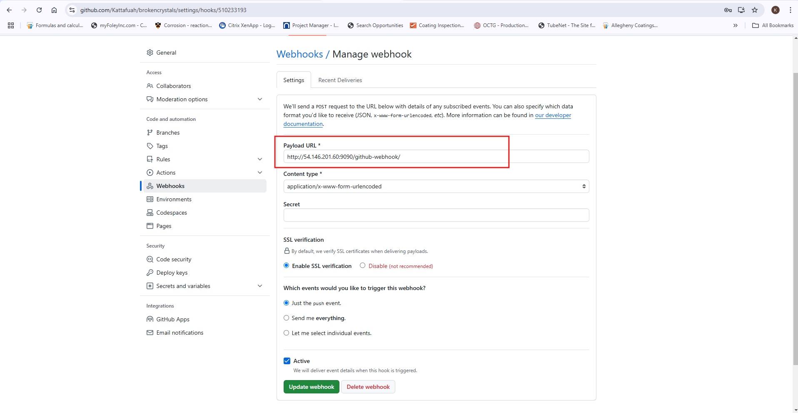

* Scroll down and click "Add webhook" or "Update webhook". 
* On the Jenkins Server go to the pipeline and click on "Configure"
* Scroll down and tick "GitHub hook trigger for GITSCM polling" under "Build Triggers"
* Click "Save".

Now the pipeline will trigger automatically once there is a push to the repository on branch "stable".

## Image scanning for deployed Docker images on Dockerhub
Docker Scout on DockerHub can provide valuable image security insights by automatically scanning images that have been built, tagged, and pushed, revealing the impact of new CVEs on those images. In this project, this process can be initiated through a manual trigger of the `.github/workflows/csn-devsecops-wf.yml` file in this repository. This workflow offers three trigger options: btpscani, deploy, and dast. The btpscani (abreviation for build, tag, push, scan and image) trigger handles the build, tag, push, and scan of Docker images. The deploy trigger is responsible for deploying the application to your Kubernetes cluster, while the dast trigger runs OWASP ZAP to identify vulnerabilities post-deployment.

Prerequisites: 
* Dockerhub account
* Dockerhub repository

Image scanning for Docker images deployed to Dockerhub can be achieved by following the following steps: 
* Create a Dockerhub account (if you don't already have one).
* Create a Dockerhub repository for your Docker image - in this case "brokencrystals".
* Select the brokencrystals repository on Dockerhub, got to "settings" and check the "Docker Scout image analysis" option. 
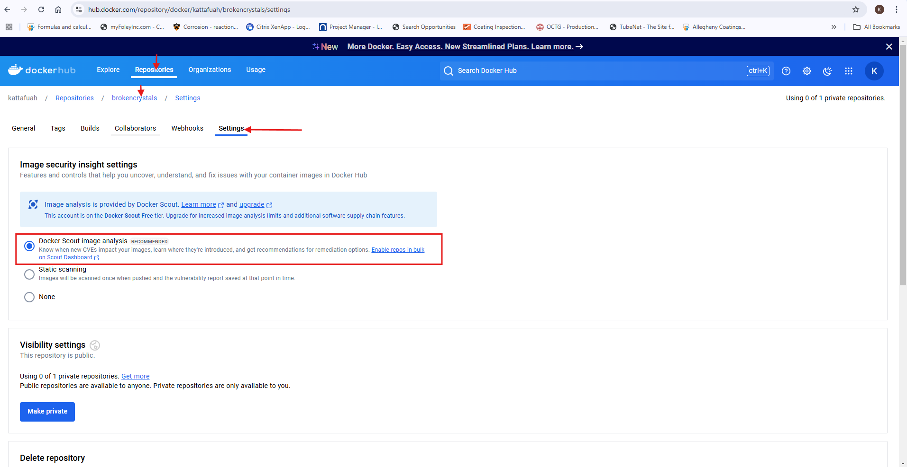
* In your GitHub repository, create a secret/variable for your DOCKERHUB_USERNAME
* In your GitHub repository, create a secret for your DOCKERHUB_PASSWORD

Triggering the pipeline:
* Go to your GitHub repository
* Click on "Actions"
* Click on "csn-devsecops-wf" on the left pane under "All workflows"
* Click on "Run workflow" and select the "btpscani" option
* Click on "Run workflow" to trigger the pipeline.
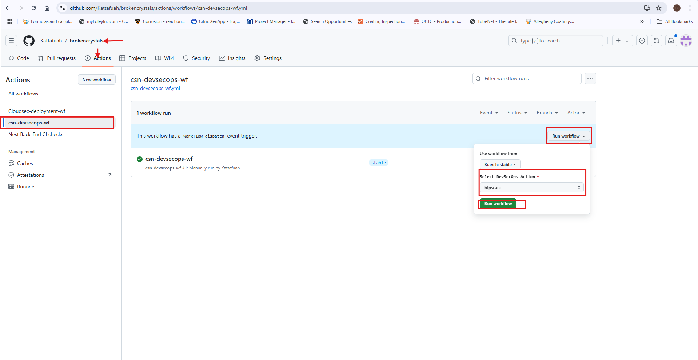

This process builds, tags, and pushes your images to your Docker Hub account, allowing you to view the results of the Docker Scout scan, as shown in the image below. Each image is tagged with the github.sha to represent the specific commit associated with the build.
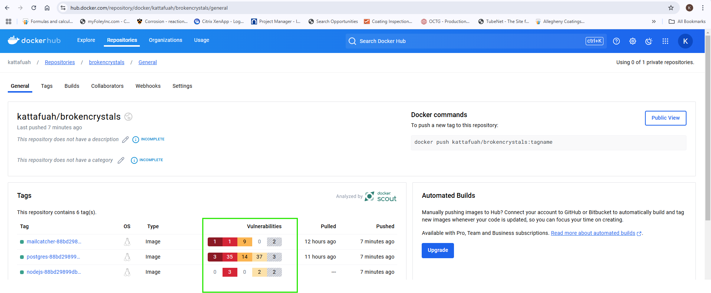
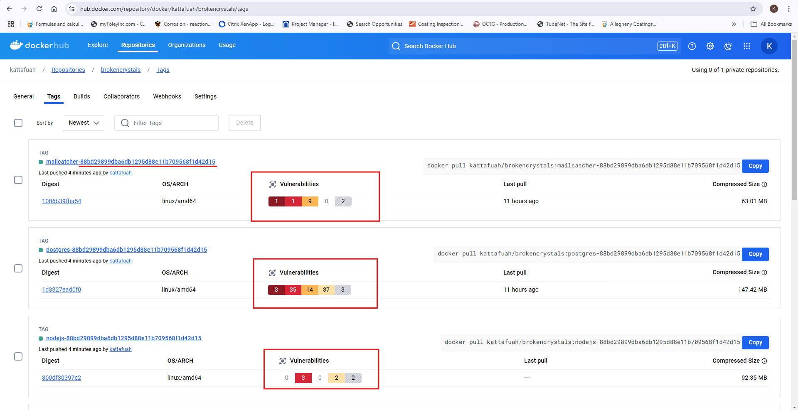

## Deployment to AWS EKS Integrated with AWS Secrets Manager 
In cloud services and DevSecOps, securely managing sensitive data like database credentials and API keys is crucial for maintaining application integrity. AWS Secrets Manager simplifies this by allowing developers to securely store, manage, and retrieve secrets. This section covers how to integrate AWS Secrets Manager with Amazon EKS, enabling Kubernetes workloads to access required secrets securely.

After completing a SAST scan, if you are satisfied with the security analysis or have resolved any identified vulnerabilities, including those flagged by Docker Scout, you can proceed to deploy the pushed images. Ensuring that all SAST and Docker Scout issues have been addressed helps maintain a secure and robust deployment.

The Kubernetes Secrets Store CSI Driver integrates with AWS Secrets Manager to securely store and manage sensitive data, loading secrets via a CSI volume and mounting them onto pods using mounted volumes.

**High-level flow diagram of how it works**


### Creating AWS EKS cluster and associated resources

To integrate AWS Secrets Manager with Amazon EKS, follow these steps:

Prerequisites:

* AWS Account

* kubectl utility

* eksctl utility *(To install kubectl & eksctl utilities, check [here](https://docs.aws.amazon.com/eks/latest/userguide/setting-up.html))*

* Helm *(To install Helm, check [here](https://docs.aws.amazon.com/eks/latest/userguide/helm.html))*


Steps: 

1. To create an EKS cluster with an OIDC provider provisioned, run:

```eksctl create cluster -f ./eks-manifest-files/cluster.yaml```

**NB:** 

The `./eks-manifest-files/cluster.yaml` manifest file is a configuration file for `eksctl`, a CLI tool for creating and managing Amazon EKS clusters. It specifies details for deploying an EKS cluster using AWS CloudFormation under the hood as can be seen from the image below, which provisions and manages the necessary AWS resources for the cluster. Remember to: 
* Change the `name` and `region` values to your desired cluster name and AWS region.
* Modify the `nodeGroups` configuration (such as `instanceType` and `desiredCapacity`) to suit your application’s requirements.

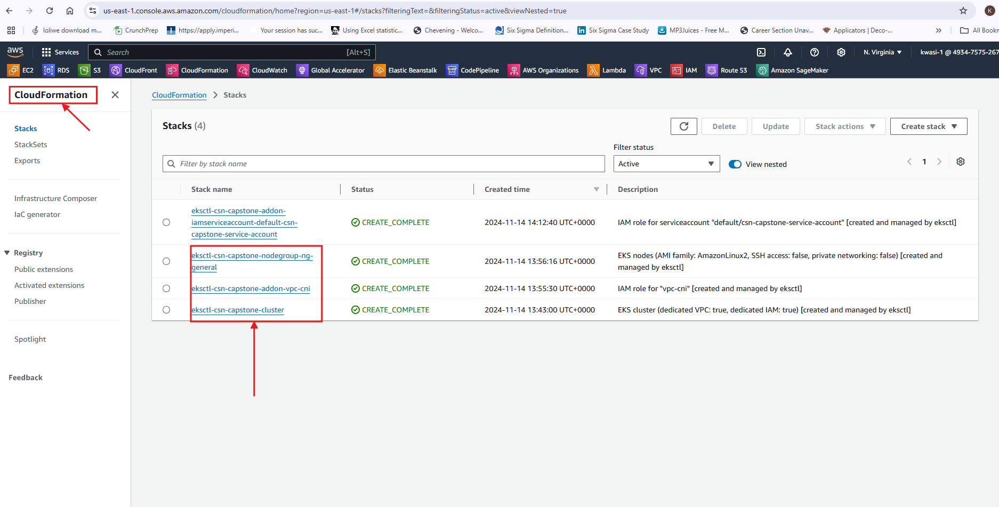

Upon successful creation, your cluster should be up and running with "Status" Active and necessary resources deployed as seen in the images that follow:

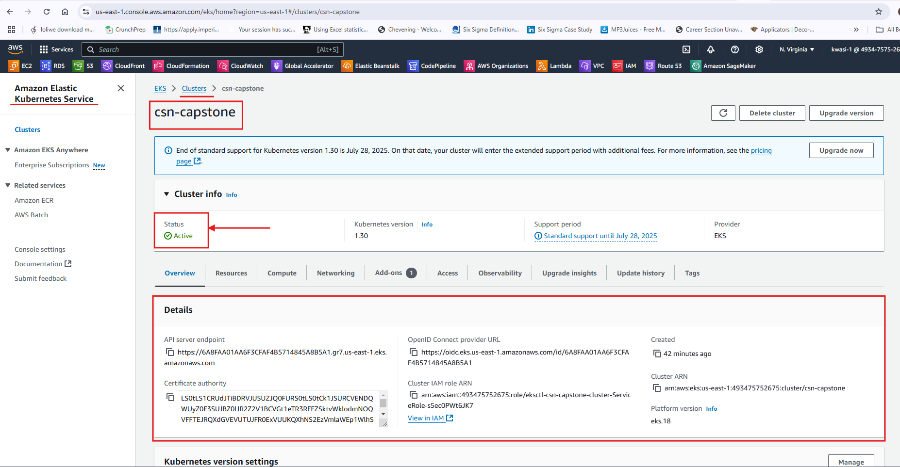

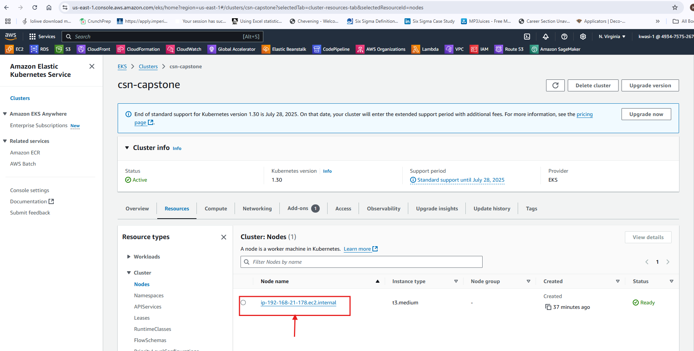

2. Install the Secrets Store CSI Driver by executing:

```
helm repo add secrets-store-csi-driver https://kubernetes-sigs.github.io/secrets-store-csi-driver/charts
helm install csi-secrets-store secrets-store-csi-driver/secrets-store-csi-driver --namespace kube-system --set syncSecret.enabled=true
```

3. Install AWS Secrets and Config Provider (ASCP) by executing:

```kubectl apply -f https://raw.githubusercontent.com/aws/secrets-store-csi-driver-provider-aws/main/deployment/aws-provider-installer.yaml```

4. Create secret inside AWS Secrets Manager:
```
#Export Region and Cluster Name
REGION=us-east-1
CLUSTERNAME=csn-capstone

#Create Secret
SECRET_ARN=$(aws --query ARN --output text secretsmanager  create-secret --name dbcredentials --secret-string '{"DATABASE_USER":"dev", "DATABASE_PASSWORD":"SecOps"}' --region "$REGION")
```
If you navigate to AWS Secrets Manager in AWS console you should see your secret credentials created and stored as shown in the image below:

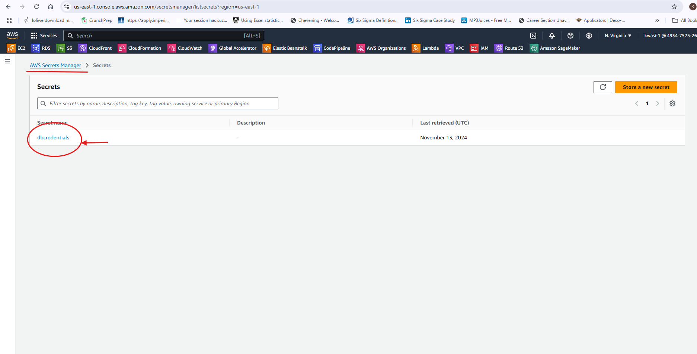

5. Create IAM policy via:
```
POLICY_ARN=$(aws --region "$REGION" --query Policy.Arn --output text iam create-policy --policy-name csn-capstone-iam-policy --policy-document '{
    "Version": "2012-10-17",
    "Statement": [ {
        "Effect": "Allow",
        "Action": ["secretsmanager:GetSecretValue", "secretsmanager:DescribeSecret"],
        "Resource": ["$SECRET_ARN"]
    } ]
}')
```
**NB:** 

Before running the code to create the IAM policy, ensure you provide the value for `SECRET_ARN`, which corresponds to the ARN of the AWS Secrets Manager secret you want to access. This ensures that the created policy correctly specifies which secret can be accessed. Replace `$SECRET_ARN` with your actual secret ARN to avoid errors during policy creation. Also name the policy accordingly. 

Upon successful creation, a search for the policy in the IAM console of your AWS acount using the policy name used during creation should yield a result as shown below: 

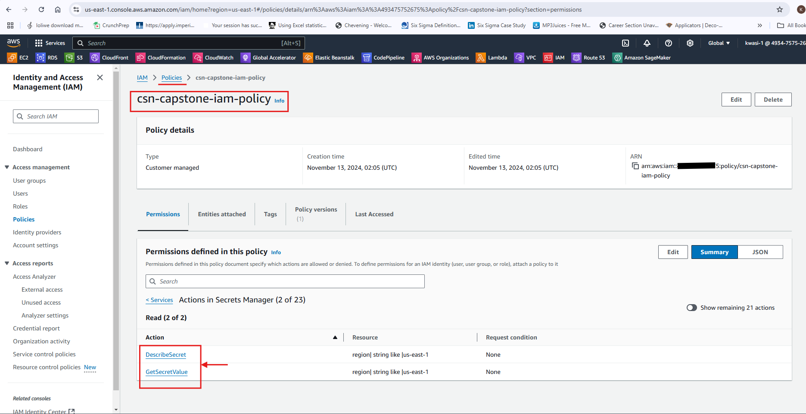

6. Create a Service Account using: 

```
eksctl create iamserviceaccount --name csn-capstone-service-account --region="$REGION" --cluster "$CLUSTERNAME" --attach-policy-arn "$POLICY_ARN" --approve --override-existing-serviceaccounts
```

The service account will be linked to the IAM policy created in the previous step as can be seen in the image below. This is known as IAM Role for Service Account (IRSA). Be sure to provide the POLICY_ARN of the policy created in step 5 in the code. Also, name the service account appropriately for your application. 

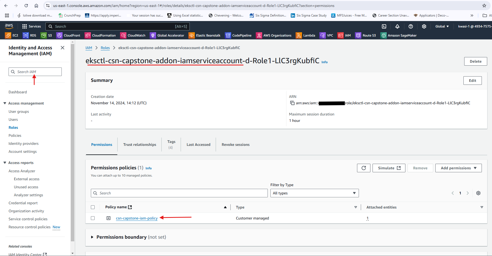

csn-capstone-service-account deployed in cluster shown via `Lens`:

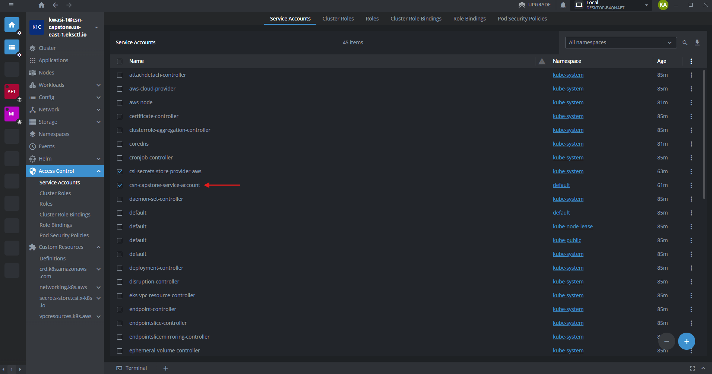

7. Create AWS Secret Provider Class by running:

```kubectl apply -f ./eks-manifest-files/csn-capstone-secret-provider.yaml```

This `csn-capstone-secret-provider.yaml` manifest file defines a `SecretProviderClass` resource, which is used by the Secrets Store CSI driver to retrieve secrets from AWS Secrets Manager and inject them into Kubernetes pods. The `SecretProviderClass` configuration specifies how the secrets should be accessed and mounted in the pod.

**NB:**
* Change the `metadata` details (like `name` and `namespace`) to match your preferences.
* Ensure the `objects` section matches the ARN and version of the secret you created in step 4.

Successful creation is as shown below: 

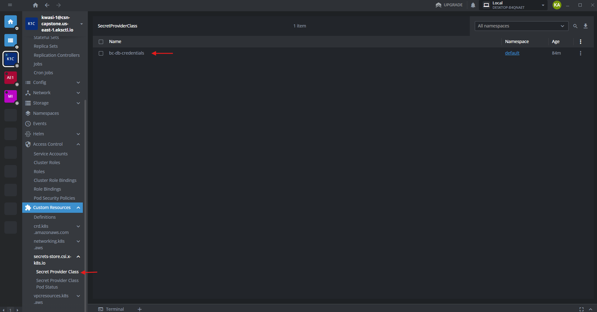

8. Deploying to the EKS Environment

Prerequisites
* An AWS EKS cluster with a ready Cluster and Node Group.
* Necessary AWS IAM permissions to configure deployments.
* Configured AWS secrets in your GitHub repository.
* Docker images built and tagged, and available in your container registry.

### Application Deployment Steps using GitHub Actions
Follow these steps to deploy the application to your AWS EKS cluster using the ```csn-devsecops-wf.yml``` GitHub Actions workflow.

1. #### Configure Repository Secrets
* Ensure that ```AWS_ACCESS_KEY_ID``` and ```AWS_SECRET_ACCESS_KEY``` are configured as secrets in your GitHub repository to allow access to AWS services.

2. #### Update the AWS EKS Cluster Name
* Open the ```csn-devsecops-wf.yml``` workflow file and navigate to line 82.
* Replace ``csn_capstone`` with the name of your EKS cluster.

3. #### Navigate to the GitHub Actions Tab
* Go to your GitHub repository and click on the "Actions" tab in the top menu.

4. #### Select the ``csn-devsecops-wf`` Workflow
* Choose ```csn-devsecops-wf``` from the list on the left sidebar.

5. #### Trigger the Deployment Workflow

* Click the "Run workflow" button on the GitHub Actions page.
* In the pop-up that appears, ensure that "deploy" is selected as the action to be performed.
* Click "Run workflow" to start the deployment process.

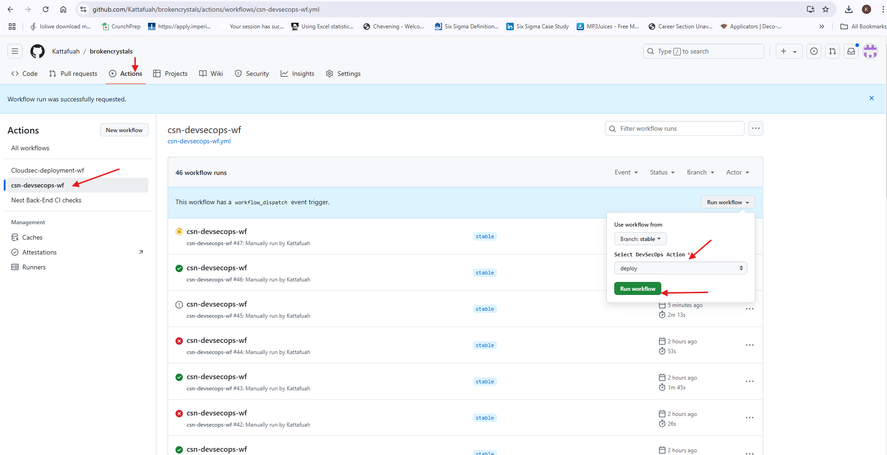

6. #### Monitor the Workflow Execution
The workflow logs can be monitored to track the progress of your deployment and ensure there are no issues during the execution.

**NB:**
The deployment makes use of a Kubernetes manifest file ```./eks-manifest-files/app.yml```. 

This `app.yaml` manifest file defines various Kubernetes resources including ConfigMaps, Services, Deployments, and volume mounts, used to configure and deploy a web application and its associated database.

Successful deployment of the application can be seen under the `jobs` tab of the workflow file `csn-decsecops-wf` in GitHub Actions as shown in the image below: 

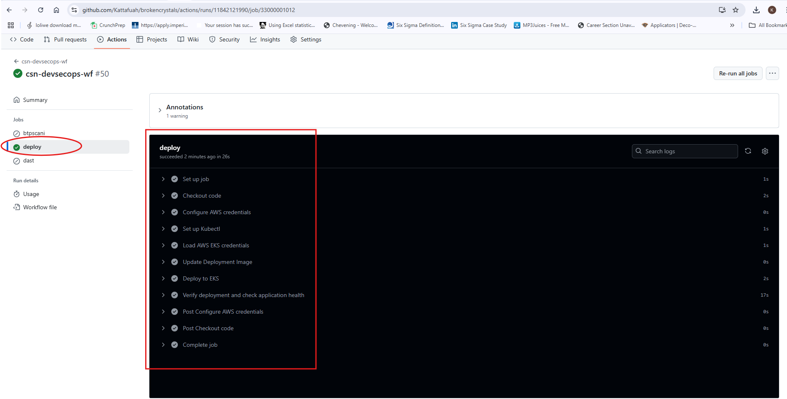

And evidenced in your console by navigating to the resouces tab under your cluster, clicking  "Workloads" and "Deployments" as shown below:

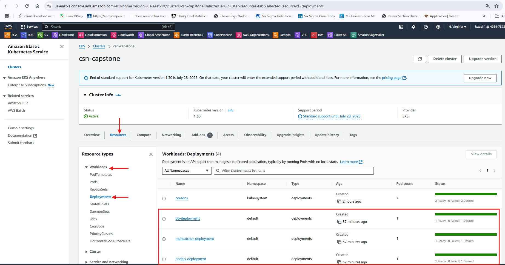

Your pods should be up and running as well.

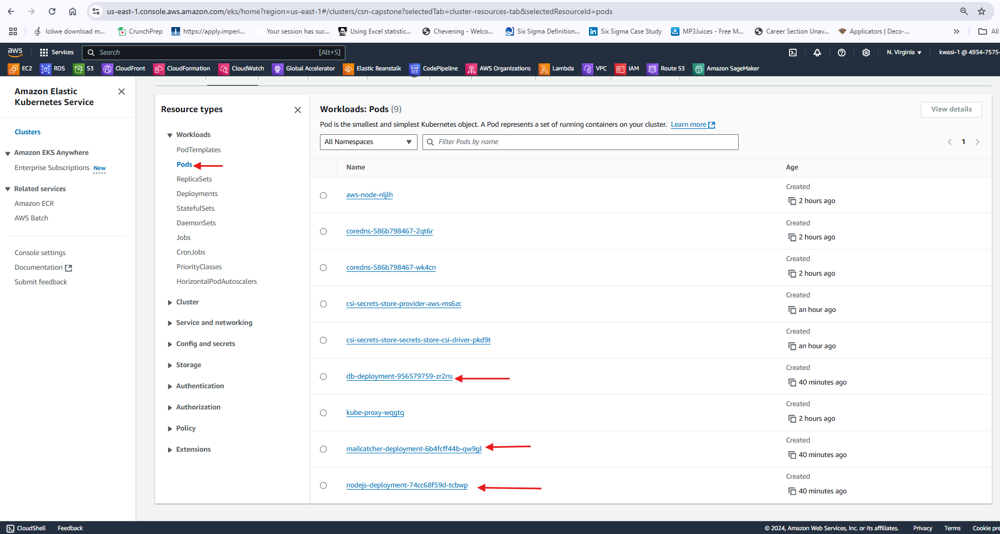

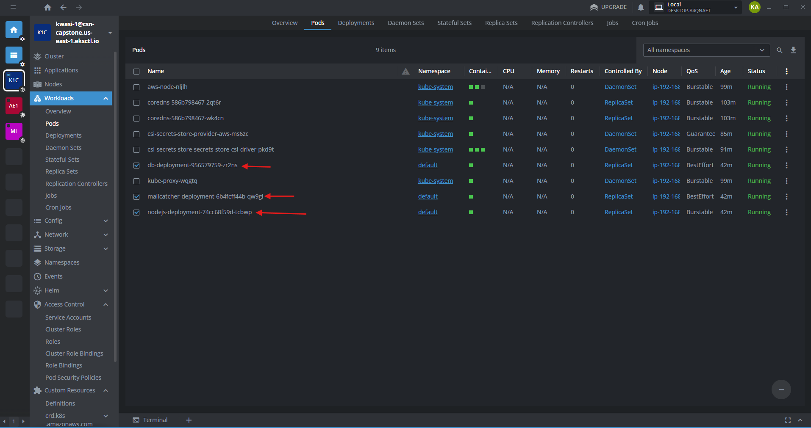

**Key Notes:**
* **ConfigMap Data**: Be sure to modify the values under `metadata` and `data` sections to match your environment, especially the database connection details and other environment variables.
* **ServiceAccountName**: The `serviceAccountName` field in the Deployment spec should match the ServiceAccount you created (in this case, `csn-capstone-service-account`).
* **secretProviderClass**: Ensure that the `secretProviderClass` field references the correct `SecretProviderClass` created for your secrets management (e.g., `bc-db-credentials`).
* **env and volumeMounts**: Review and adjust the `env` and `volumeMounts` sections to ensure they align with your secrets and environment configurations to prevent errors and conflicts during deployment.

Please check all these details carefully to avoid deployment issues.

#### Accessing the application

The "deploy" `job` outputs the Application URL in the "Verify deployment and check application health" step. 

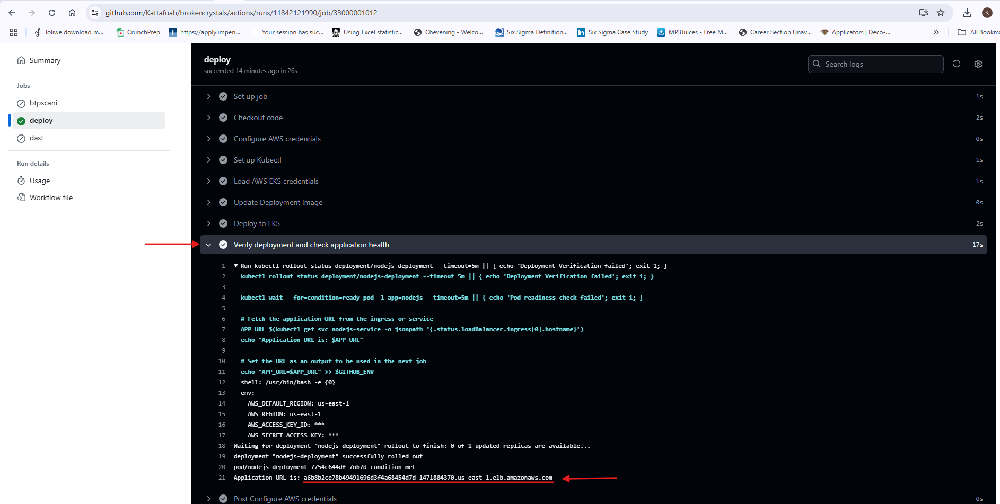

This can be copied into a browser to have access to the UI of the application. 
e.g., ```http://a1a9e5b397fa44e49ad2d17b654b6c97-384296215.us-east-1.elb.amazonaws.com``` 

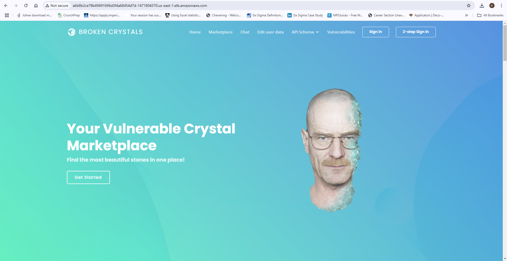

Alternatively, you can follow these steps to get the application URL:

1. Click on "Services" under "Service and networking" tab on your console to get your nodejs-service.

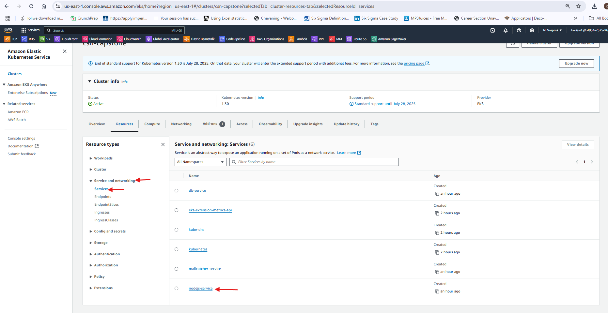 

2. Click on it and copy the Load balancer URL.

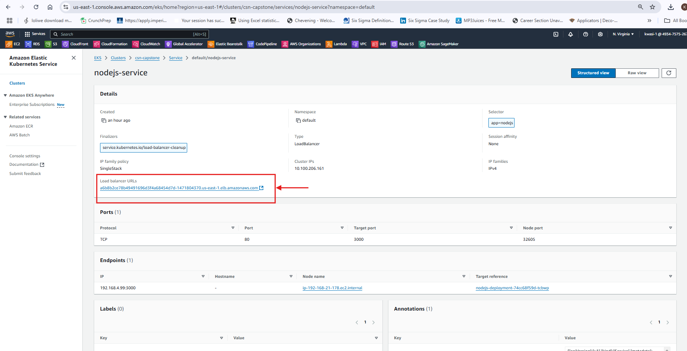

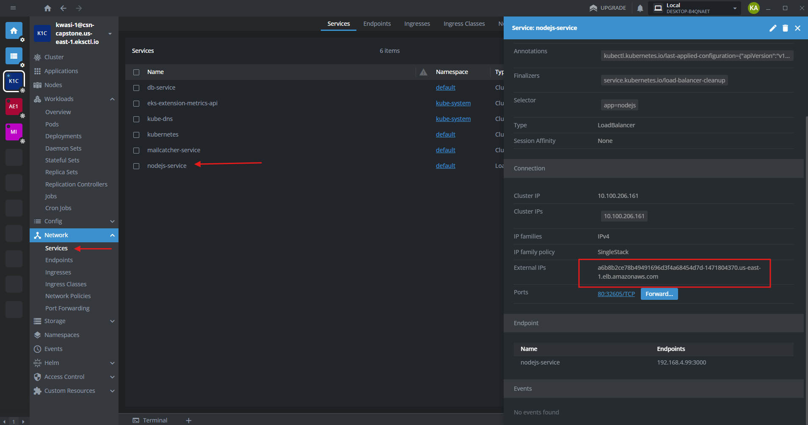

3. Paste the URL in your browser, press enter and the broken crystals application should be up and running.


Another option is to run ```kubectl get svc nodejs-service``` on your terminal and use the `External-IP` output provided.

## Running the OWASP ZAP DAST Scan via GitHub Actions Workflow
The OWASP ZAP DAST (Dynamic Application Security Testing) scan can be executed through the GitHub Actions workflow file `csn-devsecops-wf`. The DAST scan is part of the pipeline and runs after a successful application deployment to AWS EKS. To trigger the scan, ensure that the application is deployed first by setting the appropriate input action for the `deploy` job.

Once the application deployment is completed successfully, the `dast` job triggers automatically.   
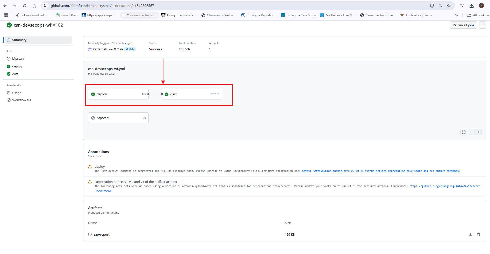

During this step, the URL of the deployed application is dynamically extracted and passed to the OWASP ZAP scan. The `dast` job uses this URL to run a security scan on the live application. 
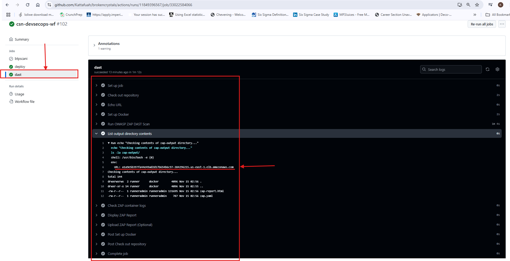

The scan is run using the OWASP ZAP Docker image, which is configured to run the baseline scan (`zap-baseline.py`) against the deployed application. The results of the scan are stored in the `zap-output` directory and uploaded as an artifact, where they can be reviewed later. 

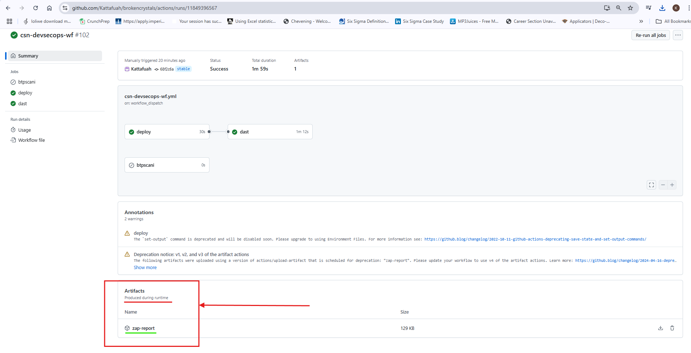

A screenshot of how this report looks like is shown below:
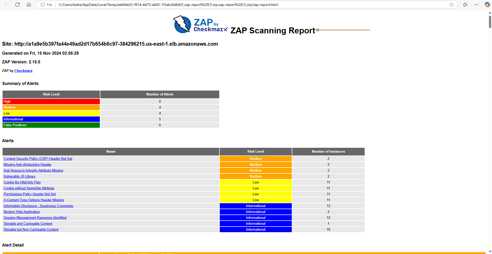

The entire process, from deployment to DAST scanning, is automated and you can review the scan report and logs from the output directory to assess the security vulnerabilities detected by OWASP ZAP. The report downloaded from GitHub Actions `Artifacts` can be found in this repo in the zip repo called `zap-report.zip`.


